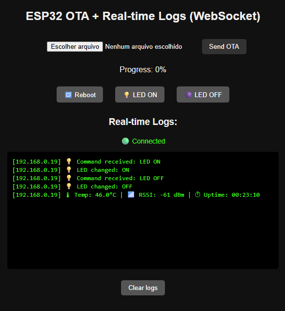
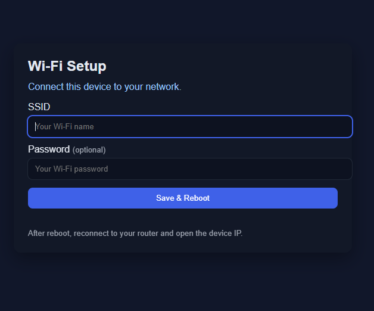
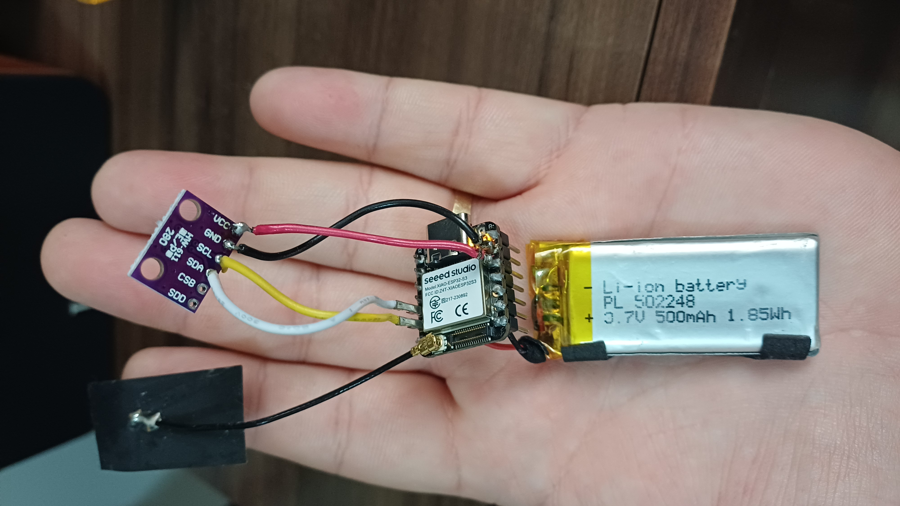

# OTA-IOT (ESP32S3 + SPIFFS + OTA + WebSocket)

Firmware developed for ESP32-S3 supporting:

- Firmware update via **OTA** (Over-The-Air)
- Web interface hosted on **SPIFFS**
- Real-time communication using **WebSocket**
- Automatic upload of the file system before firmware upload
- LED feedback for system status and OTA confirmation

This project serves as a base for IoT applications that require remote control, a local web interface, and OTA firmware updates.

---

## ⚙️ Requirements

- **VS Code** with the [PlatformIO IDE extension](https://platformio.org/install/ide?install=vscode)
- **Supported board:** ESP32-S3 (example: *Seeed Studio XIAO ESP32S3*)
- **Framework:** Arduino
- **Required library:**
  - [WebSockets by Links2004](https://registry.platformio.org/libraries/links2004/WebSockets)

---

## 📂 Project Structure

```
OTA-IOT/
 ┣ 📂 data/                → Files stored in the SPIFFS filesystem
 ┃ ┣ index.html            → Main dashboard: controls LED, displays logs, and system info.
 ┃ ┗ wifi.html             → Wi-Fi setup page: allows users to enter SSID and password manually.
 ┣ 📂 src/
 ┃ ┗ main.cpp              → Main firmware source code
 ┣ 📄 extra_script.py       → Script to automatically upload SPIFFS before firmware
 ┣ 📄 platformio.ini        → PlatformIO configuration file
 ┗ 📄 .gitignore
```

---

## 🚀 How to Use

### 1️⃣ Clone the repository

```bash
git clone https://github.com/engperini/OTA-IOT.git
cd OTA-IOT
```

---

### 2️⃣ Open in VS Code

Open the project using VS Code with PlatformIO installed and wait for all dependencies to download automatically.

---

### 3️⃣ Connect your ESP32-S3

Connect your device via **USB cable** — the **first upload must always be done via cable**.  
After this initial setup, all future updates can be done **Over-The-Air (OTA)**.

Check that the device is detected as a serial port (e.g., `COM7` or `/dev/ttyUSB0`).

---

### 4️⃣ Build and upload

From PlatformIO's left sidebar menu, click **Upload (arrow →)**  
or use the terminal:

```bash
pio run -t upload
```

The `extra_script.py` ensures that SPIFFS is uploaded **before the firmware**.  
You’ll see messages like:

```
=== Uploading SPIFFS before firmware ===
[SUCCESS] SPIFFS done!
[SUCCESS] Firmware upload complete!
```

---

### First Boot (Wi-Fi not configured)

If this is your first time running the firmware, or if Wi-Fi credentials were erased,
the ESP32-S3 will start in Access Point mode.

On your computer or phone, connect to the Wi-Fi network:
ESP32-Setup

Open your browser and go to:
```
http://192.168.4.1
```

You’ll see the Wi-Fi setup page (wifi.html) where you can enter your network SSID and password.

After saving, the ESP32-S3 will reboot automatically and connect to your configured Wi-Fi.

### 5️⃣ Access the web interface

After the upload, open the **PlatformIO Serial Monitor**:

```bash
pio device monitor
```

You’ll see something like:

```
Connected to WiFi!
IP Address: 192.168.1.45
```

Open a browser and navigate to your ESP’s IP address:

```
http://192.168.1.45
```

> 💡 The IP will vary depending on your local Wi-Fi network.

---

## 🌐 Web Interface

<p align="center">
  
  <br>
  <em>Real-time control and OTA via browser</em>
</p>


## 🌐 Features

### `index.html`
This is the main dashboard page shown when accessing your ESP’s IP address.  
It provides:
- LED control (turn ON/OFF);
- Real-time system logs through WebSocket;
- System information: internal temperature, Wi-Fi signal strength (RSSI), and uptime;
- OTA firmware upload with progress bar;
- Visual connection indicator (WebSocket status);
- Remote reboot button.

## 🌐 Wifi Setup

<p align="center">
  
  <br>
  <em>Initial Wifi Setup</em>
</p>

### `wifi.html`
This page handles Wi-Fi configuration and is useful when the device has no saved credentials.  
It allows users to:
- Scan and select nearby Wi-Fi networks;
- Enter SSID and password manually;
- Save and reboot the ESP32-S3 with new credentials.

> This feature is ideal for **Access Point (Hotspot) mode**, automatically enabled if no Wi-Fi credentials and connection is detected on startup. 

---

## 🔄 OTA Update

1. Access your device via browser (e.g., `http://192.168.1.45`)
2. Upload a new `.bin` file (generated during compilation)
3. The LED will blink three times indicating success
4. The ESP will automatically restart and run the new firmware

## 🌐 Esp32S3_XIAO

<p align="center">
  
  <br>
  <em>XIAO Sense Hardware</em>
</p>

---

## 🧠 Automatic SPIFFS Upload (`extra_script.py`)

This script runs automatically before the firmware upload, ensuring your `data/` files are always up to date.

```python
Import("env")
from SCons.Script import DefaultEnvironment

def before_upload(source, target, env):
    print("=== Uploading SPIFFS before firmware ===")
    spiffs_env = DefaultEnvironment()
    spiffs_env.Replace(UPLOAD_PORT=env.get("UPLOAD_PORT"))
    spiffs_env.Replace(UPLOAD_SPEED=env.get("UPLOAD_SPEED"))
    spiffs_env.Execute("platformio run -t uploadfs")

env.AddPreAction("upload", before_upload)
```

---

## ⚙️ `platformio.ini` Configuration

```ini
[env:xiao_esp32s3]
platform = espressif32
board = seeed_xiao_esp32s3
framework = arduino
monitor_speed = 115200
board_build.filesystem = spiffs
lib_deps = links2004/WebSockets@^2.7.1
extra_scripts = extra_script.py
```

---

## 💡 Useful Tips

- If the upload fails, disconnect and reconnect your ESP32-S3.
- Ensure `index.html` and `wifi.html` are inside the `data/` folder.
- To manually update only the SPIFFS filesystem:
  ```bash
  pio run -t uploadfs
  ```
- To open the serial monitor:
  ```bash
  pio device monitor
  ```

---

## 📘 Author

**Developed by:** engperini  
**License:** MIT  
**Version:** 1.1  
**Compatible with:** ESP32-S3 (XIAO, DevKit, etc.)

---

✨ *A DIY IoT-ready project supporting OTA updates, WebSocket logging, Wi-Fi setup, and local SPIFFS web hosting.*
---
⭐ **If you find this project useful, give it a star!**  
Your support helps me improve and share more IoT tools like this.

